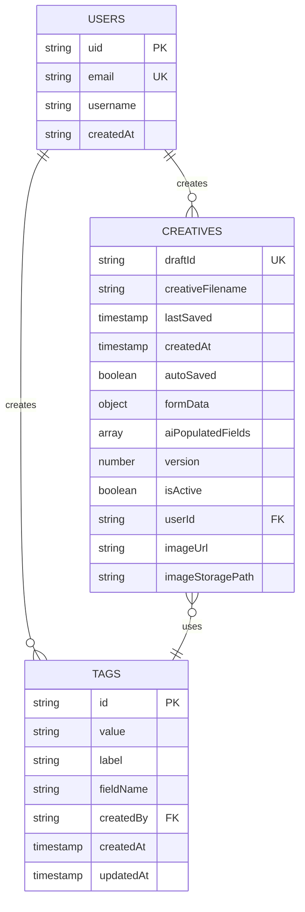

# CRY Application - Entity Relationship Diagram (ERD)

## Overview
The Creative Review Yield (CRY) application uses Firebase Firestore as its NoSQL database. Below is the complete Entity Relationship Diagram showing all collections, their attributes, and relationships.

## Database Collections

### 1. **users** Collection
Stores user account information and authentication data.

| Field | Type | Description | Required | Notes |
|-------|------|-------------|----------|-------|
| uid | string | Firebase Auth User ID (Document ID) | Yes | Primary Key |
| email | string | User email address | Yes | Unique |
| username | string | Display name | Yes | |
| createdAt | string | Account creation date (ISO format) | Yes | Auto-generated |

### 2. **creatives** Collection  
Main collection for storing creative/draft data with performance metrics.

| Field | Type | Description | Required | Notes |
|-------|------|-------------|----------|-------|
| draftId | string | Unique draft identifier | Yes | Format: draft_timestamp_random |
| creativeFilename | string | Creative file name | Yes | Default: 'Untitled' |
| lastSaved | timestamp | Last save timestamp | Yes | serverTimestamp() |
| createdAt | timestamp | Creation timestamp | Yes | serverTimestamp() - only on create |
| autoSaved | boolean | Auto-save flag | Yes | Default: false |
| formData | object | All form fields data | Yes | Nested object (cleaned) |
| aiPopulatedFields | array | AI-filled field names | Yes | Default: [] |
| version | number | Version number | Yes | Auto-incremented |
| isActive | boolean | Soft delete flag | Yes | Default: true |
| userId | string | Owner's user ID | Yes | Default: 'anonymous' if not logged in |
| imageUrl | string | Firebase Storage URL | No | Added if image uploaded |
| imageStoragePath | string | Storage path | No | Added if image uploaded |
| id | string | Firestore Document ID | No | Not stored in document; used client-side only |

#### formData Nested Structure:
```javascript
formData: {
  // Metadata
  dateAdded: string,
  designer: string,
  startDate: string,
  endDate: string,
  litigationName: string,
  campaignType: string,
  campaignName: string,
  
  // Optional image upload metadata (when a File was provided)
  // Note: the raw File is never stored; only this metadata object
  uploadedImage?: {
    name: string,
    size: number,
    type: string,
    lastModified: number,
    isFileObject: boolean
  },
  
  // Performance Metrics
  amountSpent: string,
  costPerWebsiteLead: string,
  costPerClick: string,
  
  // Creative Details
  creativeLayoutType: string,
  imageryType: string[],
  imageryBackground: string[],
  messagingStructure: string,
  
  // Headline & CTA
  preheadlineText: string,
  headlineText: string,
  headlineTags: string[],
  headlineIntent: string[],
  ctaLabel: string,
  ctaVerb: string,
  ctaStyleGroup: string,
  ctaColor: string,
  ctaPosition: string,
  
  // Copy & Audience
  copyAngle: string[],
  copyTone: string[],
  audiencePersona: string,
  campaignTrigger: string,
  
  // Flags
  questionBasedHeadline: boolean,
  clientBranding: boolean,
  iconsUsed: boolean,
  markedAsTopAd: boolean,
  needsOptimization: boolean
}
```

### 3. **tags** Collection
Stores reusable tags for form field options and categorization.

| Field | Type | Description | Required | Notes |
|-------|------|-------------|----------|-------|
| id | string | Document ID | Yes | Doc ID (not stored as a field) |
| value | string | Tag value (for forms) | Yes | |
| label | string | Display label | Yes | |
| fieldName | string | Associated form field | Yes | Index |
| createdBy | string | Creator's user ID | Yes | Foreign Key -> users.uid |
| createdAt | timestamp | Creation timestamp | Yes | Auto-generated |
| updatedAt | timestamp | Last update timestamp | Yes | Auto-generated |

## Entity Relationships



## Relationships Explained

### 1. Users → Creatives (One-to-Many)
- One user can create multiple creatives/drafts
- Each creative belongs to exactly one user
- Relationship established via `creatives.userId` → `users.uid`
- Note: User authentication handled by Firebase Auth, minimal user data stored in Firestore

### 2. Users → Tags (One-to-Many)
- One user can create multiple tags
- Each tag has a creator
- Relationship established via `tags.createdBy` → `users.uid`

### 3. Creatives ↔ Tags (Many-to-Many)
- Creatives use multiple tags through form fields
- Tags can be used by multiple creatives
- Implicit relationship through `formData` field values matching `tags.value`

## Firebase Storage Structure

```
creative-images/
├── {draftId}/
│   ├── {imageName}.jpg
│   ├── {imageName}.png
│   └── ...
```

## Indexes

### Firestore Index Notes:
1. **creatives** collection:
   - Current implementation performs client-side sorting by `lastSaved` after querying with equality filters (`userId`, `isActive`), so no composite index is required for ordering.
   - Recommended (if switching to server-side ordering): `userId` + `isActive` + `lastSaved` (DESC)

2. **tags** collection:
   - Single-field index on `fieldName` (default Firestore indexing typically covers this)

## Data Flow

### Creative Upload Flow:
1. User uploads image → Firebase Storage (optional)
2. Form data captured → Validated with Zod schema
3. FormData cleaned → Removes undefined values and File objects
4. Draft saved → Firestore `creatives` collection with:
   - Auto-generated draftId if new
   - serverTimestamp() for lastSaved
   - serverTimestamp() for createdAt (only on create)
   - Incremented version number
5. Auto-save triggered → Updates every 30 seconds
6. Image upload handled separately → URL saved if successful

### Tag Management Flow:
1. Tags loaded by `fieldName` → Displayed in dropdowns
2. New tag created → Added to `tags` collection
3. Tag used in creative → Selected from dropdown
4. Tag deleted → Permanently removed from collection

## Security Rules Structure (To Be Implemented)

```javascript
// Firestore Security Rules - Suggested Structure
rules_version = '2';
service cloud.firestore {
  match /databases/{database}/documents {
    // Users can only read/write their own data
    match /users/{userId} {
      allow read, write: if request.auth != null && request.auth.uid == userId;
    }
    
    // Creatives: users can CRUD their own creatives
    match /creatives/{document} {
      allow read: if request.auth != null;
      allow create: if request.auth != null && 
        request.resource.data.userId == request.auth.uid;
      allow update, delete: if request.auth != null && 
        resource.data.userId == request.auth.uid;
    }
    
    // Tags: all authenticated users can read and create
    match /tags/{document} {
      allow read: if request.auth != null;
      allow create: if request.auth != null;
      allow update, delete: if request.auth != null && 
        resource.data.createdBy == request.auth.uid;
    }
  }
}
```

## Performance Considerations

1. **Denormalization**: 
   - Tag labels are stored directly in `formData` to avoid joins
   - User info cached in creatives to reduce lookups

2. **Indexing Strategy**:
   - Composite indexes for common query patterns
   - Single field indexes on frequently filtered fields

3. **Soft Deletes**:
   - Using `isActive` flag instead of hard deletes
   - Maintains data integrity and audit trail

4. **Real-time Updates**:
   - Using Firestore listeners for live data sync
   - Optimistic UI updates for better UX

## Future Considerations

### Potential New Collections:
1. **campaigns** - Group creatives by campaign
2. **analytics** - Store detailed performance metrics
3. **comments** - Feedback and review comments
4. **audit_logs** - Track all data changes
5. **teams** - Multi-user collaboration

### Scalability Improvements:
1. Implement data archiving for old creatives
2. Add caching layer for frequently accessed tags
3. Consider sharding for high-volume users
4. Implement batch operations for bulk updates

## Data Migration Notes

- Local storage drafts migrated to Firestore via `FirebaseDraftService.migrateLocalDrafts()`
- Version field tracks schema changes
- Backward compatibility maintained through `formData` object flexibility