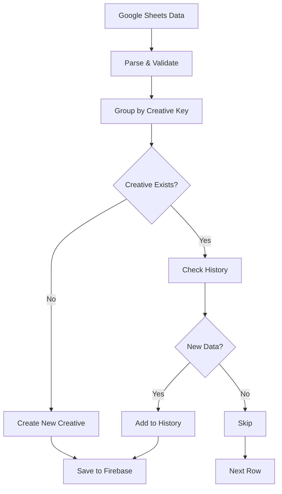

# Google Sheets to Firebase Sync - Detailed Implementation Plan

## Overview
This document outlines the plan for syncing Google Sheets data to Firebase Firestore, converting Facebook Ads report data to the Creative collection format with history tracking.

## Data Mapping Strategy

### Current Google Sheets Fields → Creative Collection Fields

#### New Fields to Add to Creative Type
```typescript
interface Creative {
  // Existing fields...
  
  // New fields from Google Sheets
  accountName?: string          // NEW: Facebook Account Name
  campaignName?: string         // NEW: Facebook Campaign Name  
  imageAssetName?: string       // Maps to: creativeFilename
  imageAssetUrl?: string        // Maps to: imageUrl
  cost?: string                 // Maps to: amountSpent
  costPerWebsiteLead?: string  // Already exists
  costPerLinkClick?: string     // Maps to: costPerClick
  
  // History tracking for cost changes
  creativeHistory?: CreativeHistoryEntry[]
}

interface CreativeHistoryEntry {
  date: string                  // ISO date string
  cost: string                  // Amount spent at this point
  costPerWebsiteLead: string   
  costPerLinkClick: string      // CPC
  syncedAt: Timestamp           // When this data was synced
  dataSource: 'google-sheets'   // Source identifier
}
```

### Field Mapping Table

| Google Sheets Column | Creative Field | Notes |
|---------------------|----------------|-------|
| Account Name | accountName | New field |
| Campaign Name | campaignName | New field |
| Image Asset Name | creativeFilename | Use existing field |
| Image Asset URL | imageUrl | Use existing field |
| Cost | amountSpent | Use existing field |
| Cost per Website Lead | costPerWebsiteLead | Already exists |
| Cost per Click | costPerClick | Already exists |

## Duplicate Detection & History Logic

### Problem Statement
- Google Sheets contains duplicate rows with same Account Name, Campaign Name, and Image Asset
- Each duplicate represents updated metrics (Cost, CPC, etc.) from different time periods
- Need to avoid creating duplicate creatives in database

### Solution: Smart Sync with History Tracking

#### Step 1: Generate Unique Creative ID
```typescript
function generateCreativeKey(row: GoogleSheetRow): string {
  // Create unique identifier based on account, campaign, and image
  return `${row.accountName}_${row.campaignName}_${row.imageAssetName}`.toLowerCase()
}
```

#### Step 2: Sync Logic Flow
```typescript
async function syncGoogleSheetToFirebase(rows: GoogleSheetRow[]) {
  // Group rows by unique creative key
  const groupedData = groupByCreativeKey(rows)
  
  for (const [key, rowVersions] of groupedData) {
    // Sort by date (if available) or by position in sheet
    const sortedVersions = sortByDate(rowVersions)
    
    // Check if creative exists in Firebase
    const existingCreative = await findCreativeByKey(key)
    
    if (!existingCreative) {
      // New creative - create with first version data
      await createNewCreative(sortedVersions[0], sortedVersions)
    } else {
      // Existing creative - update history only
      await updateCreativeHistory(existingCreative, sortedVersions)
    }
  }
}
```

#### Step 3: History Management
```typescript
async function updateCreativeHistory(
  creative: Creative, 
  newVersions: GoogleSheetRow[]
) {
  const existingHistory = creative.creativeHistory || []
  const newHistoryEntries = []
  
  for (const version of newVersions) {
    // Check if this exact data point already exists
    const isDuplicate = existingHistory.some(entry => 
      entry.cost === version.cost &&
      entry.costPerWebsiteLead === version.costPerWebsiteLead &&
      entry.costPerLinkClick === version.costPerClick
    )
    
    if (!isDuplicate) {
      newHistoryEntries.push({
        date: version.date || new Date().toISOString(),
        cost: version.cost,
        costPerWebsiteLead: version.costPerWebsiteLead,
        costPerLinkClick: version.costPerClick,
        syncedAt: serverTimestamp(),
        dataSource: 'google-sheets'
      })
    }
  }
  
  if (newHistoryEntries.length > 0) {
    // Update creative with new history and latest metrics
    const latestVersion = newVersions[newVersions.length - 1]
    await updateCreative(creative.id, {
      // Update current metrics to latest
      amountSpent: latestVersion.cost,
      costPerWebsiteLead: latestVersion.costPerWebsiteLead,
      costPerClick: latestVersion.costPerClick,
      // Append new history entries
      creativeHistory: [...existingHistory, ...newHistoryEntries]
    })
  }
}
```

## Implementation Steps

### Phase 1: Update Data Model
1. Add new fields to Creative interface
2. Update form schema in single upload page
3. Add form inputs for new fields

### Phase 2: Create Sync Service
1. Create `lib/google-sheets-sync-service.ts`
2. Implement duplicate detection logic
3. Add history tracking functionality

### Phase 3: Update Google Sheets Page
1. Add "Sync to Database" button
2. Show sync progress and status
3. Display conflict resolution UI if needed

### Phase 4: Update UI Components
1. Add history viewer in Creative details
2. Show cost trends over time
3. Display last sync date

## Sync Process Flow



## Handling Edge Cases

### 1. Missing Required Fields
- If critical fields are missing (Account Name, Campaign Name, Image Asset), skip the row
- Log warning for review

### 2. Invalid Data Formats
- Validate cost fields are numeric
- Convert date formats to ISO strings
- Sanitize text fields

### 3. Large Data Sets
- Batch process in chunks of 100 rows
- Show progress indicator
- Allow pause/resume

### 4. Conflict Resolution
- If manual data exists for a creative, don't overwrite
- Show conflicts to user for manual resolution
- Keep audit log of all sync operations

## Database Structure

### Firestore Collections
```
/creatives/{creativeId}
  - All existing fields
  - accountName: string
  - campaignName: string
  - creativeHistory: [
      {
        date: "2024-01-15",
        cost: "1250.50",
        costPerWebsiteLead: "25.50",
        costPerLinkClick: "2.35",
        syncedAt: Timestamp,
        dataSource: "google-sheets"
      }
    ]
  - lastSyncedAt: Timestamp
  - syncSource: "google-sheets" | "manual"
```

## Benefits of This Approach

1. **No Duplicates**: Each unique creative exists only once
2. **Full History**: Track performance changes over time
3. **Data Integrity**: Preserve both manual and synced data
4. **Audit Trail**: Know when and where data came from
5. **Scalable**: Can handle large datasets efficiently
6. **User-Friendly**: Shows clear history and trends

## Next Steps

1. Review and approve this plan
2. Update Creative type definitions
3. Add new form fields to single upload page
4. Implement sync service
5. Add history viewer UI
6. Test with sample data
7. Deploy to production